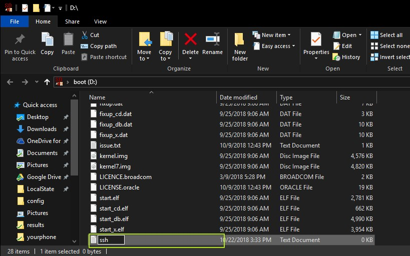

## Flashing an RPi image to an SD-card 

Link naar de site van de image installer van raspberry pi os (raspbian :`( )

[image installer](https://www.raspberrypi.com/software/)

## Enable ssh headless

twee mogelijk heden

1: tijdens de image installer door SHIFT + CTRL + X

2: in de boot van de SD een lege textfile ssh maken



## Determining the IP address based on a MAC address

nmap command to find ip addres

```bash
nmap -sn 172.16.0.0/16 | grep -B 2 -i 'raspberry'
```

raspberry Mac address WIFI/ETH

```text
Vast Ip: 172.16.244.18
Eth Mac address:	e4:5f:01:1d:75:5d
Wifi Mac address: 	e4:5f:01:1d:75:5f
```

## Configure static IP addresses for network interfaces

chech if dhcpcd status / start and enable

```bash
sudo service dhcpcd status
sudo service dhcpcd start
sudo systemctl enable dhcpcd
```

file to edit for static ip

```bash
sudo nano /etc/dhcpcd.conf
```

copy paste at the bottom

```bash
interface eth0
static ip_address= 172.16.244.18/16
static routers= 172.16.0.1
static domain_name_servers= 172.16.0.1
```

## Setup a hostname 

```bash
sudo nano /etc/hostname -> change hostname
sudo nano /etc/hosts -> change hostname at the bottom
reboot
```

## Creating accounts 

```bash
sudo useradd <user>
```

## Creating groups and adding accounts to that group 

```bash
sudo addgroup <group>

sudo adduser <user> <group>

sudo usermod -aG <group>,<group> john

```

adding user to sudo group

```bash
sudo adduser <yourusername> sudo
```

## Locking accounts

lock password van de user en zet expire date op 1970

```bash
sudo passwd -l <user>
sudo usermod --expiredate 1 steve
```

## Setup SSH authentication using keys 

good tutorial for ssh authentication
[SSH authentication using keys](https://pimylifeup.com/raspberry-pi-ssh-keys/)

## Setup default shell for accounts 

```bash
chsh -s /bin/{shell}
```

## Installing the ZSH shell 

```bash
sudo apt update
sudo apt install zsh -y
```

## Connecting to a Wireless network via command line 

Maak een file aan genaamd (/boot/)wpa_supplicant.conf ook in de boot dicectory van de SD – card

```text
ctrl_interface=DIR=/var/run/wpa_supplicant GROUP=netdev
update_config=1
country=BE

network={
    ssid="LAB_2.85"
    psk="Dr@@dloos!"
    scan_ssid=1
}
```

reconfigure the the interface

```bash 
sudo wpa_cli -i eth0 reconfigure
```

## Configuring UFW firewall 

install firewall

```bash
sudo apt install ufw
```

Start & enable UFW

```bash
sudo systemctl start ufw
sudo systemctl enable ufw
```

allow outgoing and deny incoming connections.

```bash
sudo ufw default allow outgoing
sudo ufw default deny incoming
```

enable ssh

```bash
sudo ufw allow ssh
sudo ufw allow 22
sudo ufw allow 22/tcp
```

enable http (for apache)

```bash
sudo ufw allow http
sudo ufw allow 80
sudo ufw allow 80/tcp
```

## Install an Apache Web server and modify standard index.html file a bit 

install apache

```bash
sudo apt install apache2
```

change base apache page

```bash
nano /var/www/html/index.html
```

## Install docker and docker-compose

installing docker

```bash 
sudo apt-get update && sudo apt-get upgrade
curl -sSL https://get.docker.com | sh
```

docker setup

```bash
sudo adduser <user> docker
sudo systemctl enable docker
docker --version
```

### installing docker-compose

first install python3 and additional libs

```bash
sudo apt-get install libffi-dev libssl-dev
sudo apt install python3-dev
sudo apt-get install -y python3 python3-pip
```

```bash
sudo pip3 install docker-compose
```

## Run a basic docker image as a service when the docker-compose file is provided 

[hub docker](https://hub.docker.com)

```bash
docker run hello-world
docker-compose -f docker-compose.yaml up -d
```

## Setup a cron job that posts a message to a url using the curl command line tool

```bash
sudo apt install -y curl
crontab -l
crontab -e
```

## Creating directories and files, setting up permissions and ownership on both 

Creating directories and files

```bash
mkdir <directory>
touch <file>
```

setting up permissions and ownership

```bash
chmod <options> <permissions> <filenames>
```


## Cloning git repo's 

```bash
sudo apt-get install git
git --version
git clone url
```

## Installing basic packages using apt 

```bash
sudo apt install <package> -y
```

## Setup an MQTT broker 

install broker

```bash
sudo apt install mosquitto mosquitto-clients
```

```bash
sudo systemctl enable mosquitto
sudo systemctl status mosquitto
```

subscribe to MQTT Topic

```bash
mosquitto_sub -h localhost -t "test/message"
```

## Create regular backups of a directory (tar.gz) using cron

```bash
cp -v dir backup
```